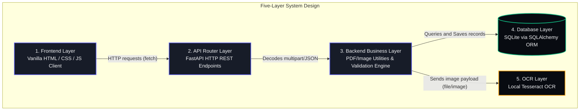

# AI-Powered Invoice Processing Agent

A full-stack, five-layer document processing application built as a college project to demonstrate clear separation of concerns. This tool allows users to upload PDF or image invoices, processes pages into images, extracts metadata using local Tesseract OCR, runs deterministic rule-based compliance checks, and displays results in an interactive review dashboard and analytics console.

---

## Five-Layer Architecture

The architecture demonstrates a strict separation of layers. The frontend interacts with the backend exclusively via RESTful JSON API endpoints over standard HTTP (`fetch`).



### Detailed Layer Roles

1. **Frontend Layer (`/frontend`)**: A pure client-side interface built with Vanilla HTML5 and JavaScript. It is served statically by the backend and handles uploads, review, history, and analytics views.
2. **API Endpoint Layer (`app/main.py`)**: A REST routing layer exposing endpoints for uploading invoices, listing records, fetching details, and analytics aggregates using Pydantic schemas.
3. **Backend Logic Layer (`app/extraction_service.py`, `app/validation_engine.py`, `app/pdf_utils.py`)**: Responsible for file persistence, PDF page conversion, local OCR text extraction, and deterministic validation checks.
4. **OCR Extraction Layer**: Uses local Tesseract OCR to convert invoice images or PDF pages into text that is parsed into structured invoice fields.
5. **Database Layer (`invoices.db` via SQLAlchemy)**: Stores invoice metadata, validation flags, and workflow state in SQLite.

---

## Setup & Installation

### 1. Prerequisites
- **Python 3.8+** installed.
- **Tesseract OCR** installed locally.
- **Poppler** (required by `pdf2image` to convert PDFs on the backend).

#### Installing Poppler (OS Specific):

*   **Windows (Highly Recommended for this environment):**
    1.  Download the latest binary pack from [@oschwartz10612's Poppler-Windows Releases](https://github.com/oschwartz10612/poppler-windows/releases/).
    2.  Extract the ZIP archive (e.g. to `C:\poppler`).
    3.  Copy the path to the `bin` directory (e.g., `C:\poppler\Library\bin` or `C:\poppler\bin`).
    4.  Add this path to your Windows System `PATH` environment variable, **OR** paste it directly into your `.env` configuration file under `POPPLER_PATH=C:\poppler\bin`.
*   **macOS:**
    ```bash
    brew install poppler
    ```
*   **Linux (Ubuntu/Debian):**
    ```bash
    sudo apt-get update
    sudo apt-get install poppler-utils
    ```

---

### 2. Project Scaffolding & Virtual Environment

Clone or download the project folder, then navigate into the directory and create a virtual environment:

```powershell
# Create environment
python -m venv venv

# Activate on Windows Powershell
.\venv\Scripts\Activate.ps1
# Or on Bash / macOS
source venv/bin/activate
```

Install Python packages:

```bash
pip install -r requirements.txt
```

---

### 3. Environment Settings Configuration

Create a `.env` file in the root of the workspace. You can use the `.env.example` as a template:

```bash
copy .env.example .env
```

Open `.env` and configure local OCR or the lightweight Ollama LLM option:

```ini
EXTRACTION_PROVIDER=tesseract
# or: EXTRACTION_PROVIDER=llm
OLLAMA_MODEL=llama3:latest
TESSERACT_CMD=C:\Program Files\Tesseract-OCR\tesseract.exe
POPPLER_PATH=C:\poppler\Library\bin
```

---

### 4. Running the Application

Start the FastAPI application server using Uvicorn:

```bash
uvicorn app.main:app --reload
```

The terminal will print:
```
INFO:     Uvicorn server running on http://127.0.5.1:8000 (Press CTRL+C to quit)
```

Now open your web browser and navigate to:
**[http://localhost:8000](http://localhost:8000)**

---

## Verifying with Local Tests

To run local unit tests on the validation engine's logic in isolation:

```bash
python scratch/test_validation.py
```
This runs assertions against mock data to verify duplicate checks, math mismatches, high-value thresholds, and empty required inputs.
